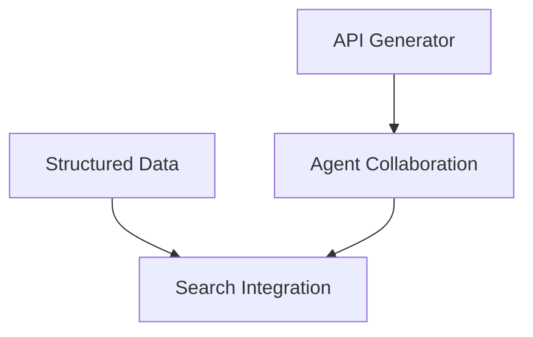

# Modules Overview

Agent Optimization Pro is built with a modular architecture, allowing for flexible configuration and extensibility. Each module provides specific functionality that can be enabled or disabled based on your needs.

## Available Modules

### 1. Structured Data Generator
- Automatically generates schema.org markup
- Supports multiple schema types
- Custom schema mapping
- Schema validation

### 2. API Generator
- Create custom REST API endpoints
- Automatic documentation
- Rate limiting
- Authentication management

### 3. Content Optimizer
- Content analysis
- SEO recommendations
- Readability scoring
- Keyword optimization

### 4. Agent Collaboration
- AI agent registration
- Inter-agent communication
- Task delegation
- Performance monitoring

### 5. Search Integration
- Enhanced search capabilities
- Custom ranking factors
- Search analytics
- Query optimization

## Module Management

### Enabling/Disabling Modules

Modules can be managed through the WordPress admin interface:

1. Navigate to Agent Optimization Pro > Settings
2. Go to the Modules tab
3. Toggle modules on/off as needed
4. Save changes

### Module Dependencies

Some modules may depend on others:



### Module Configuration

Each module has its own configuration section:

1. Click on the module name in the settings
2. Configure module-specific settings
3. Save module configuration

## Custom Module Development

Create custom modules by extending the base module class:

```php
class Custom_Module extends AOP_Base_Module {
    public function init() {
        // Module initialization
    }

    public function register_hooks() {
        // Register WordPress hooks
    }
}
```

## Performance Considerations

- Enable only needed modules
- Configure caching appropriately
- Monitor resource usage
- Optimize database queries

## Module Updates

Modules are updated with the main plugin. Keep your plugin updated to receive:
- Bug fixes
- New features
- Security patches
- Performance improvements
